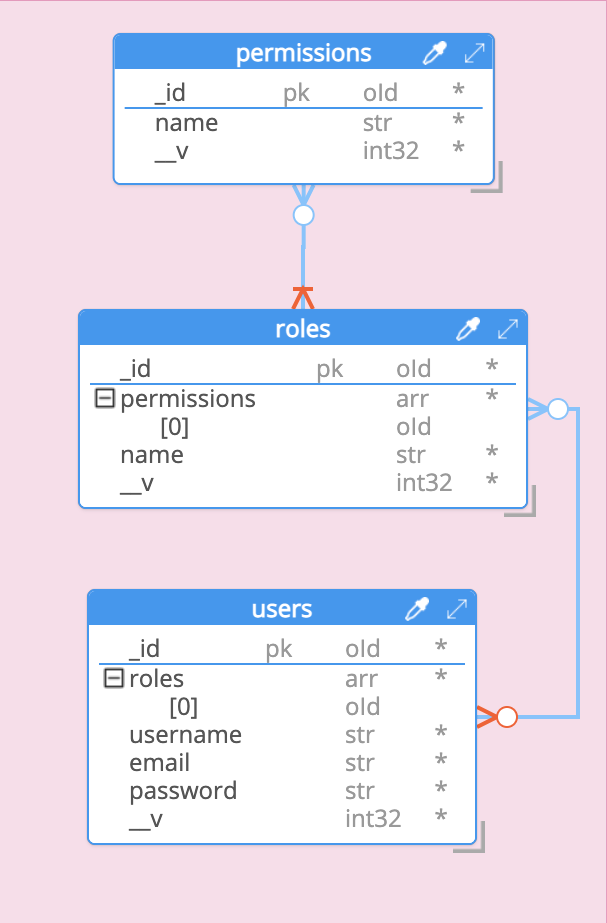

## auth-service
A simple permissioning service that can add, and validate permissions for resources.

The relationship among **USER**, **ROLE** and **PERMISSIONS** is as follows:
* USERs can have multiple ROLEs, e.g. Reader
* ROLEs consist of multiple PERMISSIONs, and each ROLE define access for one or multiple resources, e.g. READ BlogPosts, WRITE Comments
* PERMISSIONs denote the access level, e.g. READ, WRITE

The **ER Diagram** may make more sense



### **API Structure**
We are allowing a few endpoints to perform actions
##### **User**
* `POST /api/signup` - Signup as a user
* `POST /api/login` - Login as a valid user
* `GET /api/users/:userId/roles` - List all the roles added to a user denoted by `userId`
* `POST /api/users/:userId/roles` - Add a list of roles for a user denoted by `userId`

##### **Role**
* `GET /api/roles` - List all available roles
* `POST /api/roles` - Create a new role, with a list of permissions

##### **Permission**
* `GET /api/permissions` - List all available permissions
* `POST /api/permissions` - Create a new permission

### **How to run locally**
#### **Docker**
You need to have Docker and `docker-compose` installed to run this project locally.

**Clone Repository**
```bash
git clone git@github.com:goldenrati0/auth-service.git
```
**Navigate to project directory**
```bash
cd auth-service/
```
**Start project with docker-compose**
```bash
docker-compose up
```

After the containers have started successfully, you will be able to access the server browsing

`http://127.0.0.1:3000/`

### **Documentation**
[API Documentation](https://github.com/goldenrati0/auth-service/blob/main/assets/auth-service-doc.pdf)

If anything goes wrong, download from [here](https://github.com/goldenrati0/auth-service/blob/main/assets/auth-service-doc.pdf?raw=true)
